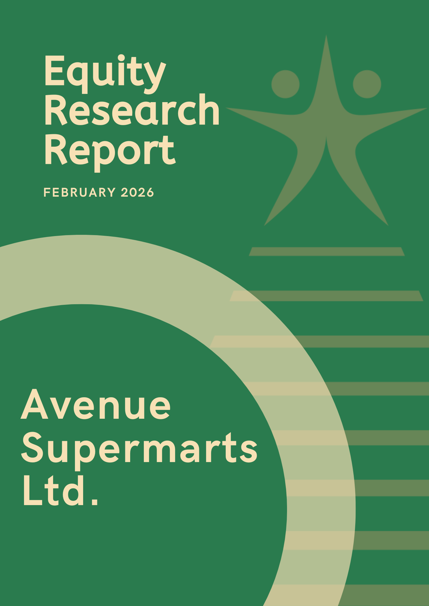

# Avenue_Supermarts_Equity_Research
Comprehensive financial valuation and equity research report on DMart (NSE: AVEU).

  

# Equity Research: Avenue Supermarts Ltd (DMart)
**Recommendation:** BUY | **Target Price:** ₹4,782 | **Horizon:** 12 Months

## 📌 Project Overview
An in-depth fundamental analysis of India's leading organized retailer. This project evaluates DMart’s "High-Volume, Low-Price" model and its financial resilience.

## 📊 Key Highlights
- **DuPont Analysis:** Deconstructed 11.95% ROE to identify asset productivity as the primary growth driver.
- **Valuation:** Utilized a Forward P/E Multiple (100x) based on FY26 EPS projections.
- **Efficiency:** Analyzed a 26-day Cash Conversion Cycle and 11x Inventory Turnover.

## 📂 Project Contents
- [Full Research Report (PDF)](./Report/Avenue_Supermarts_Equity_Research_Report.pdf)
- [Financial Valuation Model (Excel)](./Model/DMart_Valuation_Model.xlsx)
- [Live Canva Report (View Only)](https://www.canva.com/design/DAHDK5gmUHA/jRRmITff4hd2hxJUV_dQDw/view?utm_content=DAHDK5gmUHA&utm_campaign=designshare&utm_medium=link2&utm_source=uniquelinks&utlId=h106a7d200a)

## 🛠️ Skills Demonstrated
Fundamental Analysis, Financial Modeling, Ratio Analysis, Data Visualization.
